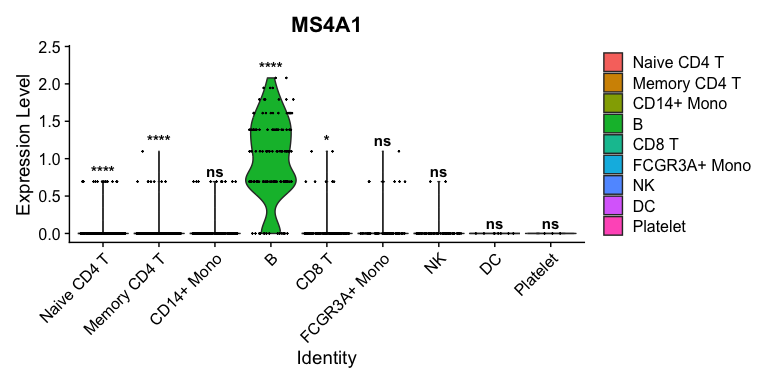
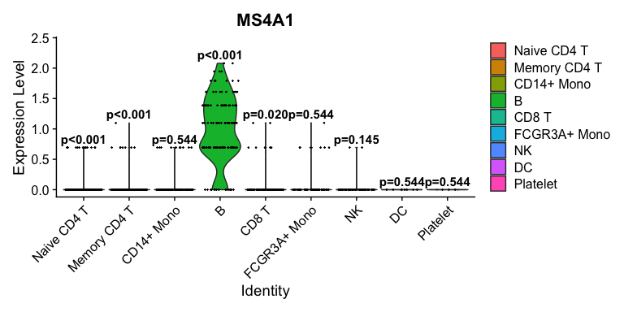
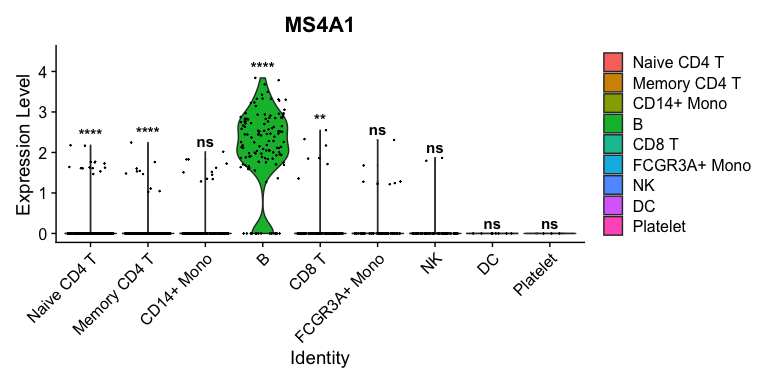

<!-- README.md is generated from README.Rmd. Please edit that file -->

# seuratTools

<!-- badges: start -->

<!-- badges: end -->

The goal of seuratTools is to …

## Installation

You can install the development version of seuratTools from
[GitHub](https://github.com/) with:

``` r
# install.packages("devtools")
devtools::install_github("hjames1/seuratTools")
```

## Example

This is a basic example which shows you how to solve a common problem:

``` r
# 载入你的包和数据
library(seuratTools)
data(pbmc1k) 

# 场景1 (默认行为): 校正P值，显示星号
VlnPlot_pooled_test(pbmc1k, "MS4A1", "seurat_annotations", p.adjust.method = "fdr", label.type = "signif")
#> Warning: The `slot` argument of `FetchData()` is deprecated as of SeuratObject 5.0.0.
#> ℹ Please use the `layer` argument instead.
#> ℹ The deprecated feature was likely used in the Seurat package.
#>   Please report the issue at <https://github.com/satijalab/seurat/issues>.
#> This warning is displayed once every 8 hours.
#> Call `lifecycle::last_lifecycle_warnings()` to see where this warning was
#> generated.
#> Warning: `PackageCheck()` was deprecated in SeuratObject 5.0.0.
#> ℹ Please use `rlang::check_installed()` instead.
#> ℹ The deprecated feature was likely used in the Seurat package.
#>   Please report the issue at <https://github.com/satijalab/seurat/issues>.
#> This warning is displayed once every 8 hours.
#> Call `lifecycle::last_lifecycle_warnings()` to see where this warning was
#> generated.
```



``` r

# 场景2: 校正P值，显示数值
VlnPlot_pooled_test(pbmc1k, "MS4A1", "seurat_annotations", p.adjust.method = "fdr", label.type = "p.value")
```



``` r

# 场景3: 不校正，直接用原始P值显示星号
VlnPlot_pooled_test(pbmc1k, "MS4A1", "seurat_annotations", p.adjust.method = NULL, label.type = "signif")
```



``` r

# 场景4: 不校正，直接用原始P值显示数值
VlnPlot_pooled_test(pbmc1k, "MS4A1", "seurat_annotations", p.adjust.method = NULL, label.type = "p.value")
```


